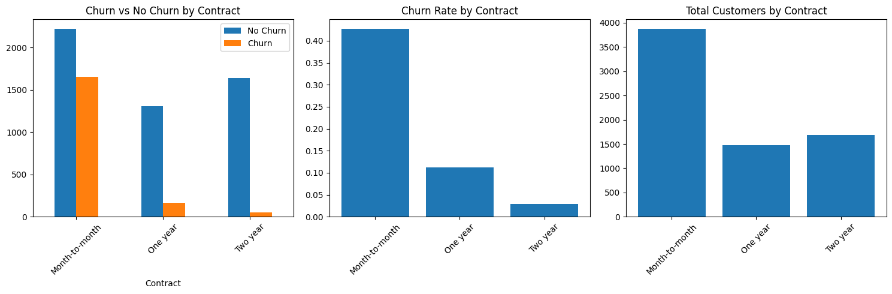
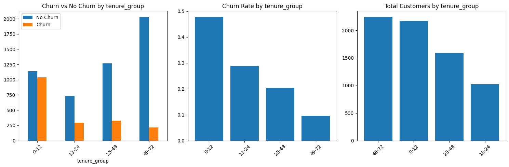
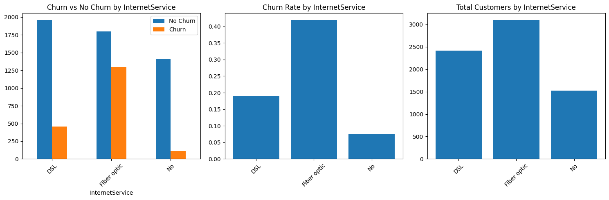

# Customer Churn Analysis

## Business

### Executive Summary
This project analyzes telecom customer churn to identify the main drivers of customer attrition and translate them into practical retention actions. The analysis shows that churn is concentrated among first-year customers, especially those on month-to-month contracts and fiber optic service. The clearest business implication is to prioritize early-lifecycle retention, contract conversion, and targeted intervention for the highest-risk customer segments.

### Business Context

Customer churn reduces recurring revenue, weakens customer lifetime value, and increases acquisition pressure because lost customers must be replaced. For a subscription-based business, improving retention is often more cost-effective than acquiring new customers.

This analysis focuses on identifying the customer, service, pricing, and billing characteristics most associated with churn so that retention efforts can be focused where they are most likely to generate value.

### Key Results

- Overall churn rate was **26.6%**
- Customers in their **first 12 months** had the highest churn risk at **47.7%**
- **Month-to-month contracts** had much higher churn (**42.7%**) than one-year (**11.3%**) or two-year (**2.8%**) contracts
- Customers with **fiber optic internet service** showed substantially higher churn than customers with DSL or no internet service
- The highest-risk segment was **month-to-month fiber optic customers in their first year**, with churn above **70%**

### Key Visuals

#### Churn by Contract Type



#### Churn by Tenure Group



#### Churn by Internet Service



#### Highest-Risk Segment View
**Churn rate (%) by contract type, internet service, and tenure group (months)**

| Contract       | InternetService | Tenure 0-12 mo   | Tenure 13-24 mo  | Tenure 25-48 mo  | Tenure 49-72 mo  |
|----------------|-----------------|------------------|------------------|------------------|------------------|
| Month-to-month | DSL             | 42.5% (293/690)  | 23.7% (55/232)   | 15.9% (36/227)   | 13.5% (10/74)    |
| Month-to-month | Fiber optic     | 70.2% (643/916)  | 50.6% (215/425)  | 43.4% (226/521)  | 29.3% (78/266)   |
| Month-to-month | No              | 22.7% (88/388)   | 10.0% (8/80)     | 3.7% (2/54)      | 50.0% (1/2)      |
| One year       | DSL             | 16.7% (7/42)     | 13.9% (11/79)    | 9.1% (22/241)    | 6.2% (13/208)    |
| One year       | Fiber optic     | 28.6% (2/7)      | 17.4% (4/23)     | 20.1% (31/154)   | 18.9% (67/355)   |
| One year       | No              | 5.4% (4/74)      | 1.1% (1/95)      | 1.6% (2/123)     | 2.8% (2/71)      |
| Two year       | DSL             | 0.0% (0/13)      | 0.0% (0/25)      | 1.3% (1/79)      | 2.2% (11/506)    |
| Two year       | Fiber optic     | —                | 0.0% (0/1)       | 8.6% (3/35)      | 7.1% (28/393)    |
| Two year       | No              | 0.0% (0/45)      | 0.0% (0/64)      | 1.2% (2/160)     | 0.8% (3/364)     |

*Tenure columns represent customer tenure groups in months.*

### Business Recommendations


1. **Target the highest-risk segment directly**

    The single most actionable finding in the dataset is that customers on month-to-month contracts using fiber optic service in their first year churn at **70.2%**. This segment combines the three strongest churn drivers simultaneously and should be the immediate focus of targeted retention campaigns and deeper root-cause investigation.

2. **Prioritise first-year retention**

   Churn risk is heavily concentrated in the early lifecycle. Customers in their first 12 months churn at **47.7%**, compared with **9.5%** for customers past four years. Onboarding quality, early support outreach, and first-year engagement programmes are the clearest intervention points.

3. **Use contract conversion as a primary retention lever**

   Month-to-month customers churn at **42.7%**, compared with **2.8%** for two-year customers — a 15× difference. Incentives that move new customers onto longer-term contracts, particularly during the first year, are likely to have the highest retention impact of any single action.

4. **Promote support and security services as retention tools**

   Customers without `TechSupport` churn at **31.2%**, compared with **15.2%** for those who have it. The same pattern holds for `OnlineSecurity` (**31.4%** vs **14.6%**). These services roughly halve churn rate among users and should be actively promoted — especially to new and month-to-month customers — as part of the onboarding and retention strategy.

5. **Monitor higher-charge customers for early churn signals**

   Customers with higher monthly charges show greater churn risk, likely reflecting pricing sensitivity or unmet value expectations in premium plans. While the direction of causality is unclear, these customers represent more revenue at risk per churned account and warrant closer monitoring and proactive outreach.


---

## Analysis

### Project Objective

To identify the strongest drivers of churn, segment high-risk customer groups, and translate the findings into practical business recommendations.

### Analysis Approach

The analysis was structured around the following questions:

- What is the overall churn rate?
- Does churn vary by customer tenure?
- Are higher-paying customers more likely to churn?
- Do support and protection services relate to retention?
- How do contract type, internet service, and payment behaviour affect churn?
- Are there meaningful demographic differences?
- Which combined customer segments show the highest churn risk?

The approach combined summary metrics, exploratory visual analysis, and segment-level comparisons to move from descriptive patterns to business conclusions.

### Main Variables Analysed

- `tenure`
- `MonthlyCharges`
- `TotalCharges`
- `Contract`
- `InternetService`
- `PaymentMethod`
- `TechSupport`
- `OnlineSecurity`
- `PaperlessBilling`
- `SeniorCitizen`
- `Churn`

### Notebook Guide

#### `01_notebook_cleandata.ipynb`
Prepares the raw dataset for analysis by:

- checking structure and missing values
- fixing the `TotalCharges` data type
- removing invalid rows
- standardising service-related categories
- encoding binary variables
- removing the identifier column
- saving the cleaned dataset

#### `02_notebook_analysis.ipynb`
Explores the main churn drivers using:

- churn overview
- correlation checks
- tenure analysis
- pricing analysis
- support and protection service analysis
- categorical churn drivers
- demographic analysis
- combined segment analysis
- final business recommendations

---

## Technical Implementation

### Technical Skills Demonstrated

- Data cleaning and preprocessing
- Exploratory data analysis
- Customer segmentation
- Business problem framing
- Data visualisation
- Translating findings into recommendations
- Modular code organisation through a reusable `src/` layer separating configuration, data loading, plotting, and helper functions from notebook logic

### Tools Used

- Python
- Pandas
- Matplotlib
- Seaborn
- Jupyter Notebook

### Project Structure

```text
customer-churn-analysis/
│
├── data/
│   ├── raw/
│   └── clean/
├── images/
│   ├── churn_by_contract.png
│   ├── churn_by_tenure.png
│   ├── churn_by_internetservice.png
├── notebooks/
│   ├── 01_notebook_cleandata.ipynb
│   └── 02_notebook_analysis.ipynb
├── src/
│   ├── config.py
│   ├── data_loader.py
│   ├── plot.py
│   └── function.py
├── README.md
└── requirements.txt
```

### How to Run

1. Clone the repository
2. Install the required packages
3. Open the notebooks in Jupyter
4. Run `01_notebook_cleandata.ipynb`
5. Run `02_notebook_analysis.ipynb`

### Installation

```bash
pip install -r requirements.txt
```
