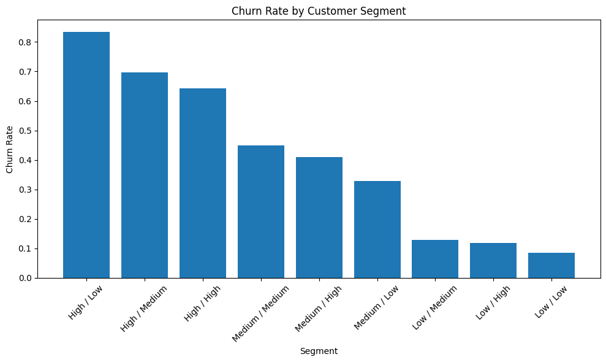

# Customer Churn Analysis

## Business

### Executive Summary
This project analyzes telecom customer churn to identify the main drivers of attrition, predict which customers are most likely to churn, and prioritize retention efforts based on both churn risk and customer value.

The analysis shows that churn is concentrated among first-year customers, especially those on month-to-month contracts and fiber optic service. Building on these descriptive insights, a predictive modeling layer was added to rank customers by churn probability and segment them into actionable retention groups.

The final outcome is not only an explanation of churn patterns, but a practical retention framework that helps answer:

- which customers are most likely to churn
- which of those customers are most valuable
- which segments should be prioritized for intervention

### Business Context

Customer churn reduces recurring revenue, weakens customer lifetime value, and increases acquisition pressure because lost customers must be replaced. For a subscription-based business, improving retention is often more cost-effective than acquiring new customers.

This project was designed to move beyond descriptive reporting and support decision-making. In addition to analyzing churn drivers, it introduces a predictive modeling workflow and a retention prioritization framework so that intervention efforts can be focused where they are most likely to create value.

### Key Results

- Overall churn rate was **26.6%**
- Customers in their **first 12 months** had the highest churn risk at **47.7%**
- **Month-to-month contracts** had much higher churn (**42.7%**) than one-year (**11.3%**) or two-year (**2.8%**) contracts
- Customers with **fiber optic internet service** showed substantially higher churn than customers with DSL or no internet service
- The highest-risk descriptive segment was **month-to-month fiber optic customers in their first year**, with churn above **70%**
- In predictive modeling, **Logistic Regression** outperformed Random Forest and was selected as the final model
- The model captured **50% of all churners within the top 20% highest-risk customers**
- Segment-level prioritization showed that the strongest retention opportunity is concentrated among **High Risk / High Value** and **High Risk / Medium Value** customers

---

## Descriptive Analysis

### Project Objective

To identify the strongest drivers of churn, segment high-risk customer groups, and translate the findings into practical business recommendations.

### Analysis Approach

The descriptive analysis was structured around the following questions:

- What is the overall churn rate?
- Does churn vary by customer tenure?
- Are higher-paying customers more likely to churn?
- Do support and protection services relate to retention?
- How do contract type, internet service, and payment behaviour affect churn?
- Are there meaningful demographic differences?
- Which combined customer segments show the highest churn risk?

The approach combined summary metrics, exploratory visual analysis, and segment-level comparisons to move from descriptive patterns to business conclusions.

### Main Variables Analysed

- `tenure`
- `MonthlyCharges`
- `TotalCharges`
- `Contract`
- `InternetService`
- `PaymentMethod`
- `TechSupport`
- `OnlineSecurity`
- `PaperlessBilling`
- `SeniorCitizen`
- `Churn`

### Key Visuals

#### Churn by Contract Type


#### Churn by Tenure Group


#### Churn by Internet Service


#### Highest-Risk Segment View
**Churn rate (%) by contract type, internet service, and tenure group (months)**

| Contract       | InternetService | Tenure 0-12 mo   | Tenure 13-24 mo  | Tenure 25-48 mo  | Tenure 49-72 mo  |
|----------------|-----------------|------------------|------------------|------------------|------------------|
| Month-to-month | DSL             | 42.5% (293/690)  | 23.7% (55/232)   | 15.9% (36/227)   | 13.5% (10/74)    |
| Month-to-month | Fiber optic     | 70.2% (643/916)  | 50.6% (215/425)  | 43.4% (226/521)  | 29.3% (78/266)   |
| Month-to-month | No              | 22.7% (88/388)   | 10.0% (8/80)     | 3.7% (2/54)      | 50.0% (1/2)      |
| One year       | DSL             | 16.7% (7/42)     | 13.9% (11/79)    | 9.1% (22/241)    | 6.2% (13/208)    |
| One year       | Fiber optic     | 28.6% (2/7)      | 17.4% (4/23)     | 20.1% (31/154)   | 18.9% (67/355)   |
| One year       | No              | 5.4% (4/74)      | 1.1% (1/95)      | 1.6% (2/123)     | 2.8% (2/71)      |
| Two year       | DSL             | 0.0% (0/13)      | 0.0% (0/25)      | 1.3% (1/79)      | 2.2% (11/506)    |
| Two year       | Fiber optic     | —                | 0.0% (0/1)       | 8.6% (3/35)      | 7.1% (28/393)    |
| Two year       | No              | 0.0% (0/45)      | 0.0% (0/64)      | 1.2% (2/160)     | 0.8% (3/364)     |

*Tenure columns represent customer tenure groups in months.*

### Descriptive Business Recommendations

1. **Target the highest-risk descriptive segment directly**

   The single most actionable descriptive finding is that customers on month-to-month contracts using fiber optic service in their first year churn at **70.2%**. This segment combines the three strongest churn drivers simultaneously and should be the immediate focus of targeted retention campaigns and deeper root-cause investigation.

2. **Prioritise first-year retention**

   Churn risk is heavily concentrated in the early lifecycle. Customers in their first 12 months churn at **47.7%**, compared with **9.5%** for customers past four years. Onboarding quality, early support outreach, and first-year engagement programmes are the clearest intervention points.

3. **Use contract conversion as a primary retention lever**

   Month-to-month customers churn at **42.7%**, compared with **2.8%** for two-year customers. Incentives that move new customers onto longer-term contracts, particularly during the first year, are likely to have the highest retention impact of any single action.

4. **Promote support and security services as retention tools**

   Customers without `TechSupport` churn at **31.2%**, compared with **15.2%** for those who have it. A similar pattern appears for `OnlineSecurity`. These services should be actively promoted, especially to new and month-to-month customers.

5. **Monitor higher-charge customers for early churn signals**

   Customers with higher monthly charges show greater churn risk, likely reflecting pricing sensitivity or unmet value expectations in premium plans. These customers represent more revenue at risk per churned account and warrant closer monitoring.

---

## Predictive Modeling

### Objective

The predictive modeling layer was added to move from identifying churn drivers to answering a more operational question:

**Which customers should the business prioritize for retention?**

### Modeling Workflow

The modeling process followed these steps:

1. Load the cleaned churn dataset
2. Prepare model-ready features using one-hot encoding
3. Split the data into training and test sets using a stratified split
4. Train and compare two baseline models:
   - Logistic Regression
   - Random Forest
5. Evaluate performance on unseen test data
6. Use the selected model to rank customers by predicted churn probability
7. Combine predicted churn risk with customer value to support retention prioritization

### Model Comparison

Two models were compared:

- **Logistic Regression** as an interpretable baseline
- **Random Forest** as a more flexible non-linear alternative

**Logistic Regression** was selected as the final model because it achieved the stronger overall performance and offered better business interpretability.

### Final Model Performance

#### Logistic Regression
- ROC-AUC: **0.836**
- Accuracy: **0.80**
- Churn precision: **0.65**
- Churn recall: **0.57**

#### Random Forest
- ROC-AUC: **0.822**
- Accuracy: **0.79**
- Churn precision: **0.64**
- Churn recall: **0.50**

### Targeting Efficiency

A key business test is whether the model can concentrate churn risk into a manageable target group.

When customers were ranked by predicted churn probability:

- the **top 20% highest-risk customers captured 50% of all churners**

This means the model is useful not only for prediction, but for improving the efficiency of retention efforts.

---

## Customer Segmentation & Retention Prioritization

### Retention Priority Framework

Predicted churn probability alone is not enough for decision-making.

To make the model output more actionable, churn risk was combined with `MonthlyCharges` as a simple proxy for customer value. This created a retention priority score that helps identify customers who are both:

- likely to churn
- financially important

Customers were then segmented by:

- **risk level**: Low, Medium, High
- **value level**: Low, Medium, High

This created a practical prioritization framework for retention strategy.

### Segment Summary

| Segment | Customers | Churn Rate | Avg. Monthly Value |
|---------|-----------|------------|--------------------|
| Low / Low | 385 | 8.6% | 25.17 |
| Low / Medium | 240 | 12.9% | 65.22 |
| Low / High | 229 | 11.8% | 98.56 |
| Medium / Low | 73 | 32.9% | 38.63 |
| Medium / Medium | 129 | 45.0% | 68.18 |
| Medium / High | 139 | 41.0% | 96.50 |
| High / Low | 12 | 83.3% | 32.62 |
| High / Medium | 99 | 69.7% | 74.41 |
| High / High | 101 | 64.4% | 92.49 |

### Segment Visualization

#### Churn Rate by Customer Segment



### Segment Insights

The segmentation shows that churn is heavily concentrated in the high-risk groups.

Key findings:

- **High Risk / High Value** customers represent the most important retention segment because they combine high churn with high revenue at risk
- **High Risk / Medium Value** customers also show very high churn and are strong candidates for targeted, lower-cost interventions
- **Low Risk** segments are comparatively stable and require minimal retention effort
- although **High Risk / Low Value** shows the highest churn rate, it is a small and lower-value segment and should not automatically be the top business priority

This confirms that churn risk alone is not enough. Customer value must also be considered when deciding where to intervene.

---

## Business Impact & Strategy

The final output of the project is not just a prediction model, but a decision-support framework for retention.

The analysis shows that the strongest retention opportunity is concentrated among customers with:

- high predicted churn risk
- medium-to-high monthly value
- service and contract characteristics already linked to churn in the descriptive analysis

This supports a retention strategy such as:

| Segment | Recommended Action |
|---------|--------------------|
| High Risk / High Value | proactive retention outreach, contract incentives, service review |
| High Risk / Medium Value | targeted email or call campaigns, selective discounts |
| Medium Risk / High Value | monitoring and early engagement |
| Low Risk / High Value | maintain service quality, low-touch relationship management |
| Low Risk / Low Value | minimal intervention |

This structure makes the project more realistic from a business perspective by linking churn analytics to prioritization, targeting, and action.

---

## Notebook Guide

### `01_notebook_cleandata.ipynb`
Prepares the raw dataset for analysis by:

- checking structure and missing values
- fixing the `TotalCharges` data type
- removing invalid rows
- standardising service-related categories
- encoding binary variables
- removing the identifier column
- saving the cleaned dataset

### `02_notebook_analysis.ipynb`
Explores the main churn drivers using:

- churn overview
- correlation checks
- tenure analysis
- pricing analysis
- support and protection service analysis
- categorical churn drivers
- demographic analysis
- combined segment analysis
- final business recommendations

### `03_notebook_modeling.ipynb`
Extends the project into predictive and decision-oriented analytics by:

- preparing model-ready data
- training and comparing Logistic Regression and Random Forest
- evaluating model performance
- ranking customers by predicted churn probability
- measuring top-20% targeting efficiency
- creating a retention priority score
- segmenting customers by risk and value
- estimating business impact
- visualizing churn by customer segment

---

## Technical Implementation

### Technical Skills Demonstrated

- Data cleaning and preprocessing
- Exploratory data analysis
- Predictive modeling
- Model evaluation
- Customer risk scoring
- Customer segmentation
- Retention prioritization
- Business problem framing
- Data visualisation
- Translating findings into recommendations
- Modular code organisation through a reusable `src/` layer separating configuration, data loading, preprocessing, modeling, evaluation, plotting, and helper functions from notebook logic

### Tools Used

- Python
- Pandas
- Matplotlib
- Seaborn
- Scikit-learn
- Jupyter Notebook

### Project Structure

```text
customer-churn-analysis/
│
├── data/
│   ├── raw/
│   ├── clean/
├── images/
│   ├── churn_by_contract.png
│   ├── churn_by_tenure.png
│   ├── churn_by_internetservice.png
│   └── churn_rate_by_segment.png
├── notebooks/
│   ├── 01_notebook_cleandata.ipynb
│   ├── 02_notebook_analysis.ipynb
│   └── 03_notebook_modeling.ipynb
├── src/
│   ├── config.py
│   ├── data_loader.py
│   ├── function.py
│   ├── plot.py
│   ├── preprocess.py
│   ├── model.py
│   └── evaluate.py
├── README.md
└── requirements.txt
